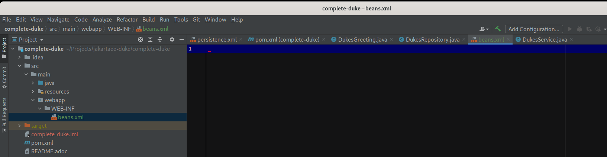
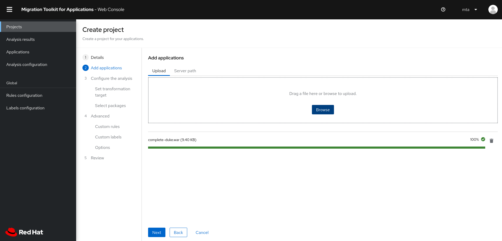
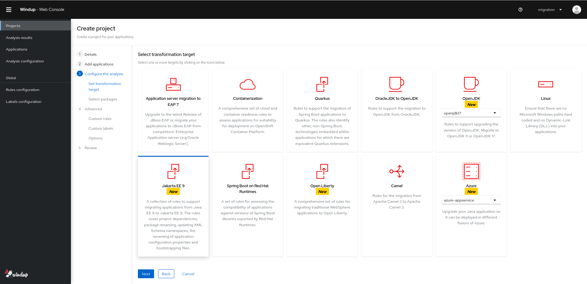
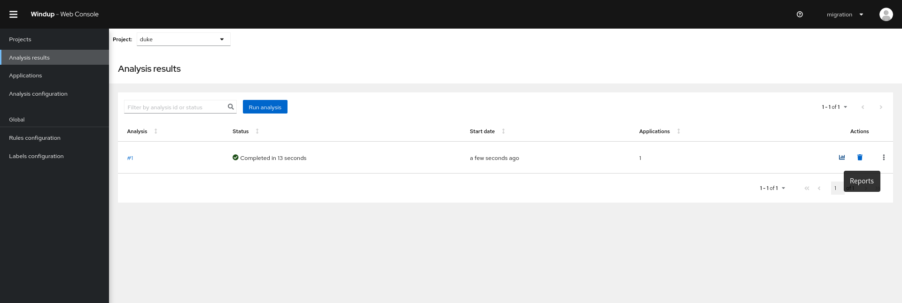
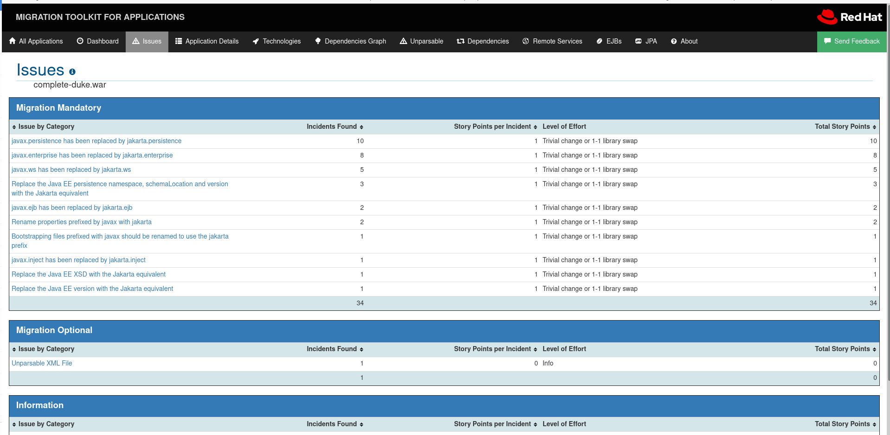
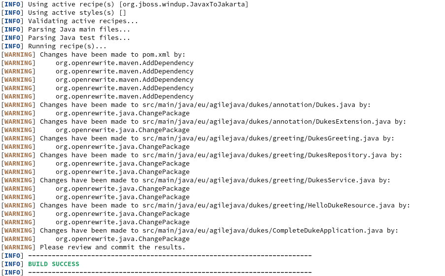
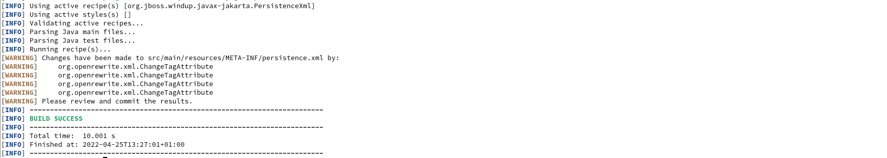
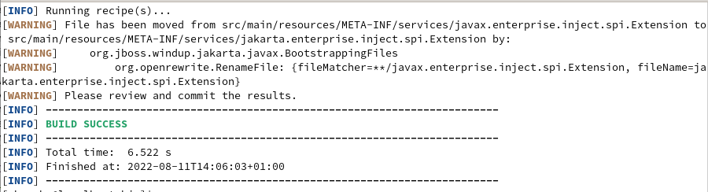

When modernizing applications a popular path is the transformation from one able to build and run on Java EE 8 to doing the same on Jakarta EE 9. Windup can help users discover the changes they need to make to their applications to achieve this, and using it in conjunction with OpenRewrite an auto-migration can be performed. This article will demonstrate an auto-migration on a sample application.

## Build of Java EE 8 Application

We will be migrating complete-duke, an app created to show the steps required to migrate from a Java EE application to one using Jakarta EE instead. Clone a copy of the app to your local machine and checkout the start-tutorial branch:

```Shell
git clone https://github.com/ivargrimstad/jakartaee-duke.git
cd jakartaee-duke
git checkout start-tutorial
```

The subfolder complete-duke is now ready to be built. Because of changes to the CDI spec implemented in this release, it’s necessary to add an empty beans.xml file to the application so that bean injection can take place. Go to the complete-duke subfolder and in the src/main/ folder, create a webapp/WEB-INF/ folder and add an empty beans.xml file there (ref. *screenshot-0*).


*screenshot-0: addition of empty beans.xml*

Build the application with java 11 using

`mvn clean package`

In the target subfolder will be the built application complete-duke.war. We will attempt to deploy this untransformed application to a Jakarta EE 9 compliant Application Server later in the process.

## Analysis of Java EE 8 Application

Now we’re happy we can build the Java EE 8 application, let’s analyse it using Windup to see what needs to change if we wish to migrate it to Jakarta EE 9.

You can download Windup [here](https://windup.github.io/downloads/). I’m using the web console tool in this case but you can perform the same analysis from the command line with the CLI tool if you wish. Extract the contents of the downloaded zip file to your local machine, open a terminal window.

Execute

`./run_windup.sh`

to start up the web console, and go to localhost:8080 in your browser. Upload the complete-duke.war file we built previously, click Next


*screenshot-1: upload the completeDuke.war into Windup*

Select the jakarta-ee target


*screenshot-2: select the target for the analysis*

Then click through the following pages and eventually select ‘Save and Run’ to start the analysis. When the analysis finishes click on the graph symbol on the right of the analysis list row to load the report:


*screenshot-3: load the report*

Click on complete-duke.war in the Application List then on the Issues tab to see what needs to be changed in the Mandatory section:


*screenshot-4: view the recommended changes*

We can see the issues are the package name changes, property names, Bootstrapping file names and changes required to XML.

## Auto-Migration to Jakarta EE 9

The CLI flavour of Windup has openrewrite recipes bundled which allow for the auto-migration of an app such as complete-duke to run on a Jakarta EE9-compliant server. Using the windup-cli shell script with the -–openrewrite switch, these recipes can be run to transform the application source code.

Go to the bin folder of your windup-cli distribution and run

```Shell
./windup-cli --openrewrite "-DactiveRecipes=org.jboss.windup.JavaxToJakarta" "-Drewrite.configLocation=<path-to-windup-cli>/rules/openrewrite/jakarta/javax/imports/rewrite.yml" --input <path-to-local-source-project>/complete-duke/  --goal run
```

You should see a message like this in the terminal window:


*screenshot-5: Transform imports results*

Again from the bin folder, run

```Shell
./windup-cli --openrewrite "-DactiveRecipes=org.jboss.windup.jakarta.javax.PersistenceXml" "-Drewrite.configLocation=<path-to-windup-cli>/rules/openrewrite/jakarta/javax/xml/rewrite.yml" --input <path-to-local-source-project>/complete-duke/  --goal run
```

And this time you should see messages like this:


*screenshot-6: Transform persistence xml results*

Finally run this from the same location

```Shell
./windup-cli --openrewrite "-DactiveRecipes=org.jboss.windup.jakarta.javax.BootstrappingFiles" "-Drewrite.configLocation=<path-to-windup-cli>/rules/openrewrite/jakarta/javax/bootstrapping/rewrite.yml" --input <path-to-local-source-project>/complete-duke/  --goal run
```

Resulting in messages like this:


*screenshot-7: Transform bootstrapping files results*

If we now run

`mvn clean package`

from the root of the completeDuke source folder, the transformed source project should build correctly without any errors.

## Deployment to Jakarta EE 9 Application Server

I’ll be using Wildfly 26.1.0-Preview, which you can download  [here](https://github.com/wildfly/wildfly/releases/download/26.1.0.Final/wildfly-preview-26.1.0.Final.zip), as my Jakarta EE9 Application Server. Wildfly has a bytecode transformation tool which deals with these issues so to prove our transformed app is Jakarta EE 9- compliant, we’ll use the unmanaged deployment mode, which bypasses the bytecode transformation.

First, attempt to deploy the original complete-duke.war built from the untransformed source code. The easiest way to do this in unmanaged mode is to use the cli tools supplied with Wildfly. Start the server by going to the bin folder of the unzipped distribution and run

`./standalone.sh`

Again, make sure the logging level is set to CONFIG. From the bin folder start the cli tool

`./jboss-cli.sh -c`

and run

`/subsystem=logging/console-handler=CONSOLE:write-attribute(name=level,value=CONFIG)`

then

`/subsystem=logging/root-logger=ROOT:write-attribute(name=level,value=CONFIG)`

Deploy the original built app

`deploy <path to original app>/complete-duke.war --unmanaged --force`

You should see in the log that the deployment fails:

```Shell
13:09:56,201 WARN [org.jboss.modules.define] (Weld Thread Pool -- 3) Failed to define class eu.agilejava.dukes.CompleteDukeApplication in Module "deployment.complete-duke.war" from Service Module Loader: java.lang.NoClassDefFoundError: Failed to link eu/agilejava/dukes/CompleteDukeApplication (Module "deployment.complete-duke.war" from Service Module Loader): javax/ws/rs/core/Application
at java.lang.ClassLoader.defineClass1 (Native Method)
```

Now undeploy, just to make sure there are no components left over from the previous attempt. Run

`undeploy complete-duke.war`

Now try the same process with the complete-duke app built from the migrated source

`deploy <path to migrated app>/complete-duke.war --unmanaged --force`

You should see the successful greeting message in the log

```Shell
=============
15:12:07,778 CONFIG [eu.agilejava.dukes] (MSC service thread 1-6) Found @Dukes annotated class:eu.agilejava.dukes.greeting. HelloDukeResource
15:12:07,779 CONFIG [eu.agilejava.dukes] (MSC service thread 1-6) Dukes message is: Hi there!
15:12:07,780 CONFIG [eu.agilejava.dukes] (MSC service thread 1-6) 
========
```

## Conclusion

With the help of Windup and OpenRewrite we were able to auto-migrate the Complete Duke application so it could successfully be deployed on a Jakarta EE 9 application server. No manual coding was required, and the approach could be used to quickly migrate large numbers of applications to run on modern application servers.


