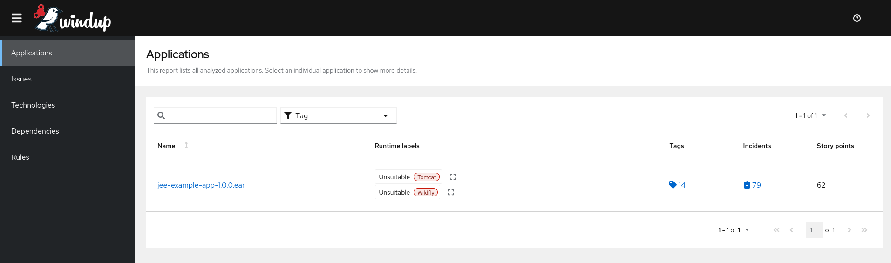
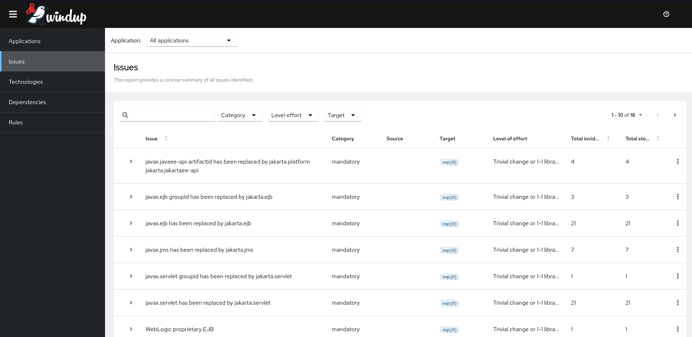
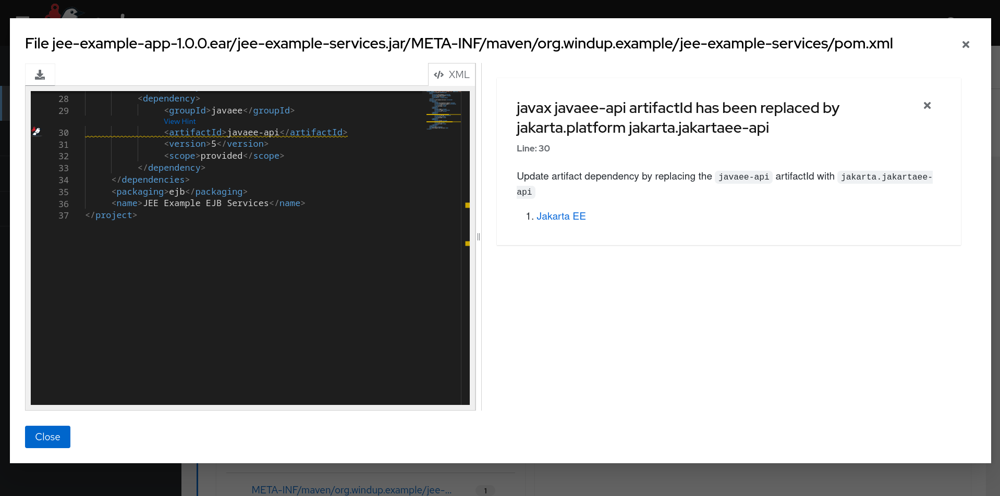
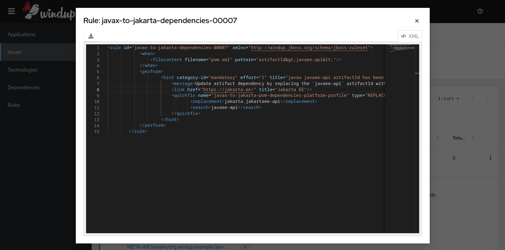
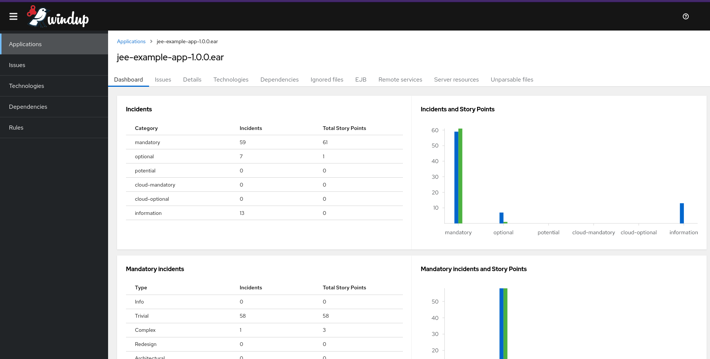
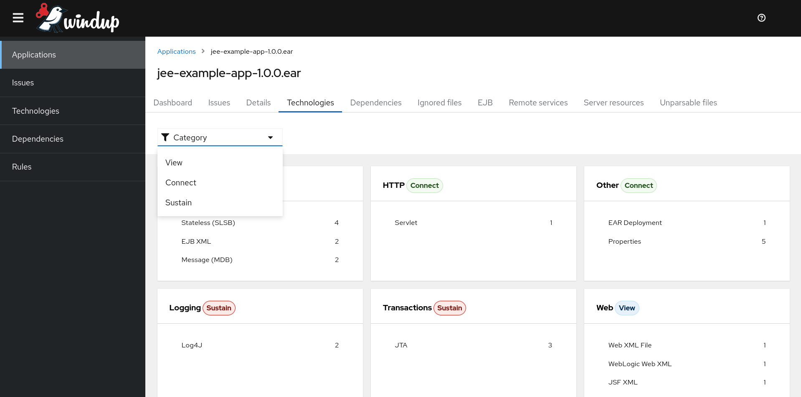
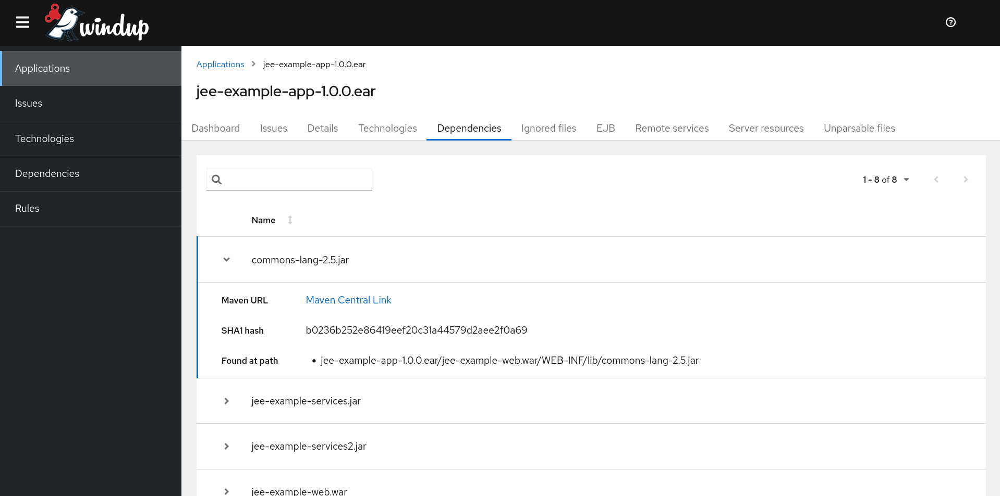
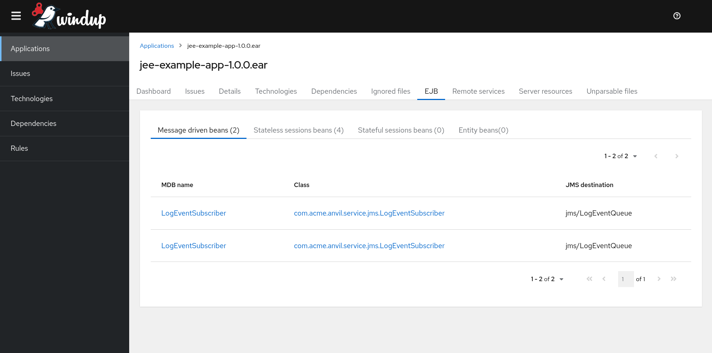
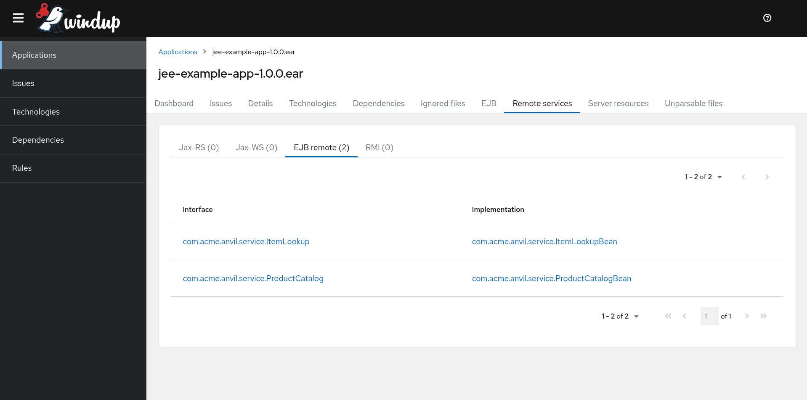
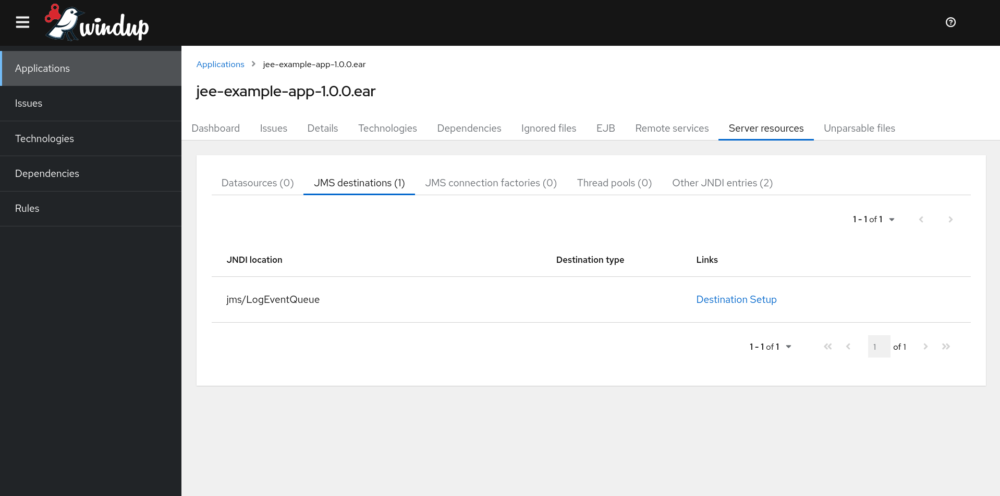

The Windup team is exited that the reports generated by Windup has been rewritten and it has been aligned to modern standards. The new reports are based on [PatternFly 4](https://www.patternfly.org/v4/) and it uses [ReactJS](https://react.dev/). The old reports were based on [Bootstrap 3](https://getbootstrap.com/docs/3.3/) and although it served us well for many years, Bootstrap 3 has been moved to its end of life.

This important change gives Windup a modern look and feel making it easy for users to vizualize the data generated after an analysis.

## How to generate the new reports

Windup will generate the new format reports by default. The new reports are fully integrated with:

- Windup CLI
- Windup Web Console
- Windup Operator

Go to [Downloads](/downloads) and start using Windup.

## Legacy reports

You can continue generating the old reports via `--legacyReports` advanced option. E.g.

```shell
$WINDUP_HOME/bin/windup-cli --input myApp.jar --target quarkus --legacyReports
```

The old reports and the new one contain the same data.

## Example Reports

### Application list

The Application list shows all the applications analyzed, and for each, the number of migration issues, story points and technology tags.



## Issues

- You can visualize `All applications` or _only one application_ issues using the selector `Application` located at the top of the page.
- We have added a set of powerful filters that enables you to be very selective as to which issues are visible on the report.



- You can visualize what Windup suggest you to do for a particular _issue_ clicking on any file located in the expanded area of each row.



- If you would like to see the _rule_ associated with each issue, you can click on the `View rule` link located at the end of each row of the table.



## Application details

You can see the details of each application selecting them in the _Application list_ page.

Depending of the characteristics of your application some reports might not be visible due to the fact that there is no data to be shown. E.g. Your application is not a [Spring](https://spring.io/) application therefore the report `Spring beans` will be hidden. Here is the list of reports that might be hidden if no data associated to the report exists.

- Ignored files
- EJB
- JPA
- Hibernate
- Spring beans
- Remote services
- Server resources
- Unparsable files
- Hard-coded IP addresses
- Compatible files (visible only if `--enableCompatibleFilesReport` advanced option was enabled)
- JBPM Processes
- Transactions (visible only if `--enableTransactionAnalysis` advanced option was enabled)

### Dashboard

- This report provides a breakdown of issues and story points by issue category. And a breakdown of incidents by java package.



### Technologies

- You can see all technologies identified in the application.



### Dependencies

- You can see dependencies of your application.



### EJB

- You can see all EJBs identified in your application.



### Remote services

- You can see all JAX-RS, JAX-WS, Remote EJBs and RMIs identified in your application.



### Server resources

- You can see all Datasources, JMS destinations, JMS Connection Factories, and Thread pools identified in your application.


